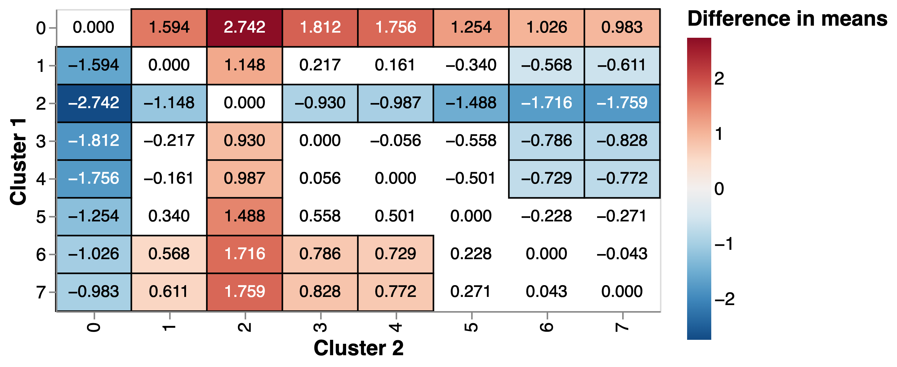

# Clustering results

In this section we present the results of our clustering analysis: 

* What C/UAs are assigned to what clusters, where are they, how do we interpret the clusters? (@subsec:output} 
* What are the differences between clusters in early year outcomes in the latest update of the data (2019) and historically?
* Who are the outperforming and underperforming C/UAs inside each cluster in the latest version of the data and historically? Are these differences linked to structural and contextual differences between C/UAs _inside_ clusters?

## Clustering outputs {#subsec:output}

### Cluster assignment results

The cluster assignment procedure with the parameters that maximise variation in early year outcomes between clusters yields seven clusters. [@tab:assignments] shows the top ten C/UAs per cluster by population.[^1]

[^1]: We use mid-2020 all-ages population estimates obtained from ONS [here](https://www.ons.gov.uk/peoplepopulationandcommunity/populationandmigration/populationestimates/datasets/populationestimatesforukenglandandwalesscotlandandnorthernireland)

|   cluster | Top 10 C/UAs by population                                                                                                                           |
|:----------:|:-----------------------------------------------------------------------------------------------------------------------------------------------------|
|         0 | Hampshire, Surrey, Hertfordshire, Oxfordshire, Cambridgeshire, Bromley, Central Bedfordshire, South Gloucestershire, Sutton, Richmond upon Thames... |
|         1 | Lancashire, Leeds, Sheffield, Kirklees, Wakefield, Dudley, Medway, Rotherham, Derby, Portsmouth...                                                   |
|         2 | Birmingham, Manchester, Bradford, Coventry, Leicester, Nottingham, Sandwell, Doncaster, Bolton, Walsall...                                           |
|         3 | County Durham, Liverpool, Wigan, Wirral, Newcastle upon Tyne, Sunderland, Sefton, Salford, Barnsley, Tameside...                                     |
|         4 | Bristol, City of, Greenwich, Plymouth, Southampton, Luton, Peterborough, Southend-on-Sea, Thurrock, Reading...                                       |
|         5 | Barnet, Croydon, Newham, Ealing, Enfield, Tower Hamlets, Wandsworth, Brent, Lambeth, Southwark...                                                    |
|         6 | Kent, Essex, Staffordshire, Nottinghamshire, Derbyshire, Lincolnshire, Warwickshire, Cumbria, Bournemouth, Christchurch and Poole, Cheshire East...  |
|         7 | Norfolk, West Sussex, Devon, Suffolk, Leicestershire, North Yorkshire, Worcestershire, Cornwall, Somerset, East Sussex...                            |
{#tab:assignments}

### Geography of clusters

We present the geography of clusters in @fig:choropleth and @fig:nuts, which shows the distribution of regions over different clusters.[^2]

[^2]:The empty spaces in the middle of the map represent C/UAs that were excluded from the analysis as a consequence of missing data (see previous section).

Both charts show some geographic patterns in the clustering such as the prevalence of London boroughs in Cluster 5, a group of contiguous C/UAs in the Sotu South, East and South West in cluster 0, and a band of C/UAs in cluster 1 cutting across the country from Hull to Blackpool. We also note that several large C/UAs in the midlands and the North including Birmingham, Manchester, Nottingham or Leicester are, differently from the C/UAs around them, assigned to Cluster 2.

 {#fig:choropleth}

 {#fig:nuts}

### Some differences between cluster constituents

We proceed to explore differences between our clusters in the secondary data that we used for our clustering (@fig:secondary and @tab:secondary) and in other sociodemographic characteristics such as size of the population and ethnic diversity based on 2001 census data (@fig:socio).[^3]

[^3]: We proxy ethnic diversity with the entropy of the distribution of ethnic groups in a C/UA based on census data available [here](https://www.nomisweb.co.uk/census/2011/qs201ew).

#### Clustering variables

[@fig:secondary] shows the average standardised score for all C/UAs in a cluster for all indicators. We do not show the indicator labels in the horizontal axis because these would be hard to read but instead represent the most salient indicators for each cluster in [@tab:secondary]. In both cases we only include indicators where the difference in the mean between C/UAs in the cluster and all other C/UAs is statistically different.

 {#fig:secondary}

|   Cluster | Significantly different variables                                                                                                                                                                                                                                                                                                                                                                                                                                                                   |
|----------:|:----------------------------------------------------------------------------------------------------------------------------------------------------------------------------------------------------------------------------------------------------------------------------------------------------------------------------------------------------------------------------------------------------------------------------------------------------------------------------------------------------|
|         0 | Deprivation score (IMD 2019)-Persons-All ages (-), Healthy life expectancy at birth-Male-All ages (+), Healthy life expectancy at birth-Female-All ages (+), Life expectancy at birth-Male-Third more deprived decile-All ages (+), Fuel poverty (low income, low energy efficiency methodology)-Not applicable-Not applicable (-)                                                                                                                                                                  |
|         1 | Life expectancy at birth-Male-Most deprived decile-All ages (-), Life expectancy at birth-Female-Most deprived decile-All ages (-), Inequality in life expectancy at birth-Male-All ages (+), Domestic abuse-related incidents and crimes-Persons-16+ yrs (+), Inequality in life expectancy at birth-Female-All ages (+)                                                                                                                                                                           |
|         2 | Under 75 mortality rate from cardiovascular diseases considered preventable (2019 definition)-Persons-<75 yrs (+), Children in relative low income families (under 16s)-Persons-<16 yrs (+), Children in absolute low income families (under 16s)-Persons-<16 yrs (+), Under 75 mortality rate from all cardiovascular diseases-Persons-<75 yrs (+), Under 75 mortality rate from cardiovascular diseases considered preventable (2019 definition)-Male-<75 yrs (+)                                 |
|         3 | Hospital admissions caused by unintentional and deliberate injuries in young people (aged 15-24 years)-Male-15-24 yrs (+), Emergency hospital admissions due to falls in people aged 65-79-Female-65-79 yrs (+), Emergency hospital admissions due to falls in people aged 65-79-Persons-65-79 yrs (+), Emergency hospital admissions due to falls in people aged 65 and over-Female-65+ yrs (+), Violent crime - hospital admissions for violence (including sexual violence)-Persons-All ages (+) |
|         4 | Emergency hospital admissions due to falls in people aged 65 and over-Persons-65+ yrs (+), Emergency hospital admissions due to falls in people aged 65 and over-Male-65+ yrs (+), Emergency hospital admissions due to falls in people aged 65 and over-Female-65+ yrs (+), Emergency hospital admissions due to falls in people aged 80+-Female-80+ yrs (+), Emergency hospital admissions due to falls in people aged 80+-Persons-80+ yrs (+)                                                    |
|         5 | New STI diagnoses (exc chlamydia aged <25) / 100,000-Persons-15-64 yrs (+), Hip fractures in people aged 65 and over-Persons-65+ yrs (-), Percentage of adults (aged 18+) classified as overweight or obese-Persons-18+ yrs (-), Hip fractures in people aged 80+-Persons-80+ yrs (-), Percentage reporting a long-term Musculoskeletal (MSK) problem-Persons-16+ yrs (-)                                                                                                                           |
|         6 | Low birth weight of term babies-Persons->=37 weeks gestational age at birth (-), Children in relative low income families (under 16s)-Persons-<16 yrs (-), Children in absolute low income families (under 16s)-Persons-<16 yrs (-), Deprivation score (IMD 2019)-Persons-All ages (-), Supporting information - % population aged 65+-Male-65+ yrs (+)                                                                                                                                             |
|         7 | Supporting information - % population aged 65+-Female-65+ yrs (+), Supporting information - % population aged 65+-Persons-65+ yrs (+), Supporting information - % population aged 65+-Male-65+ yrs (+), Supporting information - % population aged under 18-Female-<18 yrs (-), Proportion of the population meeting the recommended 5-a-day on a usual day (adults)-Persons-16+ yrs (+)                                                                                                            |
{#tab:secondary}

This analysis reveals important differences in the health and social conditions of C/UAs in different clusters: Cluster 0, which includes a number of local authorities in the South East and East tend to be less deprived, healthier and have higher life expectancy. By contrast, C/UAs in Cluster 1 tend to have lower life expectancy in the most deprived deciles, important inequalities in life expectancy, and more instances of domestic abuse. Cluster 2, which includes larger cities outside of London and the South East is characterised by high mortality rates from preventable cardiovascular diseases. Cluster 5, including several London boroughs, has a higher prevalence of Sexually Transmitted Diseases (STDs) and lower overweight and obesity rates. Cluster 7, with a number of rural C/UAs spread across the country, tend to have an older population.

We note that our analysis is not seeking to establish a causal link between these variables and early year outcomes, but to capture differences in the local context potentially underpinning and proxying socio-economic differences, challenges and advantages which might be linked to variation in early year outcomes. In that respect, differences between our clusters seem to reflect stark differences in the health and social situation in different parts of the country as well as unique challenges (e.g. around poverty, obesity or crime) that depend on the local context and which we believe should be taken into account when putting in place policies to improve early year outcomes.

#### Population size and ethnicity

In @fig:socio we dig further into other differences between the C/UAs assigned into clusters. The horizontal axis captures the ethnic diversity of the population in a C/UA based on 2001 census data, and the size of the circles represents the size of the population according to the most recent estimates from ONS. This shows high levels of ethnic diversity in London boroughs assigned to cluster 5 (and lower levels in those that were assigned to other clusters), and in the larger cities outside London and the South East included in cluster 3. 

 {#fig:socio}

## Differences in early year outcomes {#subsec:outcomes}

### Cross-sectional analysis

@fig:outcome_snap shows the distribution of early year outcomes by cluster and variable focusing on the average point score in the assessment, the score in Communications and Language, the percentage of children achieving expected outcomes and the percentage achieving good outcomes (NB we have rescaled all the variables with their z-score). 

It shows that, on average, C/UAs in cluster 0 (the cluster with less deprivation and higher life expectancy) tends to have the highest scores in all variables, while those in cluster 2 (larger cities outside London and the South East) have the worst scores. Differences between other clusters are less notable, although we highlight that C/UAs in cluster 1, with low life expectancy and high levels of unequality are not, on average, different from those in cluster 4, which includes some wealthy C/UAs in the South West and the South East. In a similar vein, early year outcomes in diverse London boroughs (cluster 5) is similar to healthy and affluent C/UAs in cluster 6.

 {#fig:outcome_snap}

 {#fig:outcome_snap}

### Evolution of differences

## Outperforming and underperforming {#subsec:outperf}

### State of play

### Historically

## Gender gap

### Snapshot

### Evolution

### Links between differences in performance and secondary data

## Robustness

### Clustering on previous years

### Comparing to existing clustering based on census data

