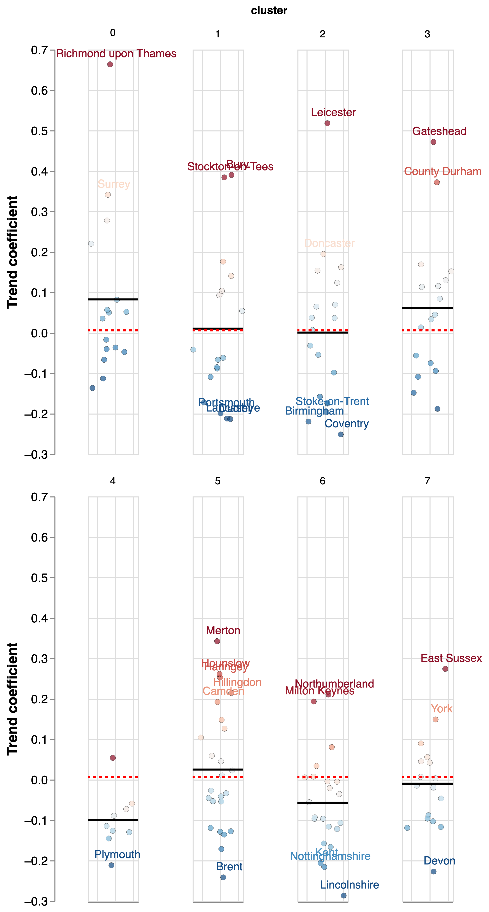

# Clustering results

In this section we present the results of our clustering analysis:

<!--This is what we have done so far
-->

- What C/UAs are assigned to what clusters, where are they, how do we interpret the clusters? (@subsec:output}
- What are the differences between clusters in early year outcomes in the latest update of the data (2019) and historically?
- Who are the outperforming and underperforming C/UAs inside each cluster in the latest version of the data and historically?
- How do different clusters perform in terms of gender parity in their average scores, how has gender parity evolved over time, and what are the outperforming and underperforming C/UAs?
- What are the differences between clusters in variables that we know are causally linked to early years outcomes?

<!--These are other things we might do
* What are the differences between clusters in terms of other secondary data of interest such as access to healthy areas & hazards, census etc.
* Are differences in performance between C/UAs in clusters linked to structural and contextual differences between those C/UAs?
-->

## Clustering outputs {#subsec:output}

### Cluster assignment results

The cluster assignment procedure with the parameters that maximise variation in early year outcomes between clusters yields seven clusters. [@tbl:assignments] shows the top ten C/UAs per cluster by population.[^1]

[^1]: We use mid-2020 all-ages population estimates obtained from ONS [here](https://www.ons.gov.uk/peoplepopulationandcommunity/populationandmigration/populationestimates/datasets/populationestimatesforukenglandandwalesscotlandandnorthernireland)

| cluster | Top 10 C/UAs by population                                                                                                                           |
| :-----: | :--------------------------------------------------------------------------------------------------------------------------------------------------- |
|    0    | Hampshire, Surrey, Hertfordshire, Oxfordshire, Cambridgeshire, Bromley, Central Bedfordshire, South Gloucestershire, Sutton, Richmond upon Thames... |
|    1    | Lancashire, Leeds, Sheffield, Kirklees, Wakefield, Dudley, Medway, Rotherham, Derby, Portsmouth...                                                   |
|    2    | Birmingham, Manchester, Bradford, Coventry, Leicester, Nottingham, Sandwell, Doncaster, Bolton, Walsall...                                           |
|    3    | County Durham, Liverpool, Wigan, Wirral, Newcastle upon Tyne, Sunderland, Sefton, Salford, Barnsley, Tameside...                                     |
|    4    | Bristol, City of, Greenwich, Plymouth, Southampton, Luton, Peterborough, Southend-on-Sea, Thurrock, Reading...                                       |
|    5    | Barnet, Croydon, Newham, Ealing, Enfield, Tower Hamlets, Wandsworth, Brent, Lambeth, Southwark...                                                    |
|    6    | Kent, Essex, Staffordshire, Nottinghamshire, Derbyshire, Lincolnshire, Warwickshire, Cumbria, Bournemouth, Christchurch and Poole, Cheshire East...  |
|    7    | Norfolk, West Sussex, Devon, Suffolk, Leicestershire, North Yorkshire, Worcestershire, Cornwall, Somerset, East Sussex...                            |
: Top C/UAs by cluster {#tbl:assignments}

### Geography of clusters

We present the geography of clusters in @fig:choropleth and @fig:nuts, which shows the distribution of regions over different clusters.[^2]

[^2]: The empty spaces in the middle of the map represent C/UAs that were excluded from the analysis as a consequence of missing data (see previous section).

Both charts show some geographic patterns in the clustering such as the prevalence of London boroughs in Cluster 5, a group of contiguous C/UAs in the Sotu South, East and South West in cluster 0, and a band of C/UAs in cluster 1 cutting across the country from Hull to Blackpool. We also note that several large C/UAs in the midlands and the North including Birmingham, Manchester, Nottingham or Leicester are, differently from the C/UAs around them, assigned to Cluster 2.

 {#fig:choropleth}

{#fig:nuts}

### Some differences between cluster constituents

We proceed to explore differences between our clusters in the secondary data that we used for our clustering (@fig:secondary and @tab:secondary) and in other sociodemographic characteristics such as size of the population and ethnic diversity based on 2001 census data (@fig:socio).[^3]

[^3]: We proxy ethnic diversity with the entropy of the distribution of ethnic groups in a C/UA based on census data available [here](https://www.nomisweb.co.uk/census/2011/qs201ew).

#### Clustering variables

@fig:secondary shows the average standardised score for all C/UAs in a cluster for all indicators. We do not show the indicator labels in the horizontal axis because these would be hard to read but instead represent the most salient indicators for each cluster in @tbl:secondary (see also [here](https://nesta-slides.s3.eu-west-2.amazonaws.com/second_diffs.html) for an interactive version of the chart). In both cases we only include indicators where the difference in the mean between C/UAs in the cluster and all other C/UAs is statistically different.

 {#fig:secondary}

| Cluster | Significantly different variables                                                                                                                                                                                                                                                                                                                                                                                                                                                                   |
| ------: | :-------------------------------------------------------------------------------------------------------------------------------------------------------------------------------------------------------------------------------------------------------------------------------------------------------------------------------------------------------------------------------------------------------------------------------------------------------------------------------------------------- |
|       0 | Deprivation score (IMD 2019)-Persons-All ages (-), Healthy life expectancy at birth-Male-All ages (+), Healthy life expectancy at birth-Female-All ages (+), Life expectancy at birth-Male-Third more deprived decile-All ages (+), Fuel poverty (low income, low energy efficiency methodology)-Not applicable-Not applicable (-)                                                                                                                                                                  |
|       1 | Life expectancy at birth-Male-Most deprived decile-All ages (-), Life expectancy at birth-Female-Most deprived decile-All ages (-), Inequality in life expectancy at birth-Male-All ages (+), Domestic abuse-related incidents and crimes-Persons-16+ yrs (+), Inequality in life expectancy at birth-Female-All ages (+)                                                                                                                                                                           |
|       2 | Under 75 mortality rate from cardiovascular diseases considered preventable (2019 definition)-Persons-<75 yrs (+), Children in relative low income families (under 16s)-Persons-<16 yrs (+), Children in absolute low income families (under 16s)-Persons-<16 yrs (+), Under 75 mortality rate from all cardiovascular diseases-Persons-<75 yrs (+), Under 75 mortality rate from cardiovascular diseases considered preventable (2019 definition)-Male-<75 yrs (+)                                 |
|       3 | Hospital admissions caused by unintentional and deliberate injuries in young people (aged 15-24 years)-Male-15-24 yrs (+), Emergency hospital admissions due to falls in people aged 65-79-Female-65-79 yrs (+), Emergency hospital admissions due to falls in people aged 65-79-Persons-65-79 yrs (+), Emergency hospital admissions due to falls in people aged 65 and over-Female-65+ yrs (+), Violent crime - hospital admissions for violence (including sexual violence)-Persons-All ages (+) |
|       4 | Emergency hospital admissions due to falls in people aged 65 and over-Persons-65+ yrs (+), Emergency hospital admissions due to falls in people aged 65 and over-Male-65+ yrs (+), Emergency hospital admissions due to falls in people aged 65 and over-Female-65+ yrs (+), Emergency hospital admissions due to falls in people aged 80+-Female-80+ yrs (+), Emergency hospital admissions due to falls in people aged 80+-Persons-80+ yrs (+)                                                    |
|       5 | New STI diagnoses (exc chlamydia aged <25) / 100,000-Persons-15-64 yrs (+), Hip fractures in people aged 65 and over-Persons-65+ yrs (-), Percentage of adults (aged 18+) classified as overweight or obese-Persons-18+ yrs (-), Hip fractures in people aged 80+-Persons-80+ yrs (-), Percentage reporting a long-term Musculoskeletal (MSK) problem-Persons-16+ yrs (-)                                                                                                                           |
|       6 | Low birth weight of term babies-Persons->=37 weeks gestational age at birth (-), Children in relative low income families (under 16s)-Persons-<16 yrs (-), Children in absolute low income families (under 16s)-Persons-<16 yrs (-), Deprivation score (IMD 2019)-Persons-All ages (-), Supporting information - % aged 65+-Male-65+ yrs (+)                                                                                                                                                        |
|       7 | Supporting information - % population aged 65+-Female-65+ yrs (+), Supporting information - % population aged 65+-Persons-65+ yrs (+), Supporting information - % population aged 65+-Male-65+ yrs (+), Supporting information - % population aged under 18-Female-<18 yrs (-), Proportion of the population meeting the recommended 5-a-day on a usual day (adults)-Persons-16+ yrs (+)                                                                                                            |
: Salient secondary variables by cluster {#tbl:secondary}

This analysis reveals important differences in the health and social conditions of C/UAs in different clusters: Cluster 0, which includes a number of local authorities in the South East and East tend to be less deprived, healthier and have higher life expectancy. By contrast, C/UAs in Cluster 1 tend to have lower life expectancy in the most deprived deciles, important inequalities in life expectancy, and more instances of domestic abuse. Cluster 2, which includes larger cities outside of London and the South East is characterised by high mortality rates from preventable cardiovascular diseases. Cluster 5, including several London boroughs, has a higher prevalence of Sexually Transmitted Diseases (STDs) and lower overweight and obesity rates. Cluster 7, with a number of rural C/UAs spread across the country, tend to have an older population.

We note that our analysis is not seeking to establish a causal link between these variables and early year outcomes, but to capture differences in the local context potentially underpinning and proxying socio-economic differences, challenges and advantages which might be linked to variation in early year outcomes. In that respect, differences between our clusters seem to reflect stark differences in the health and social situation in different parts of the country as well as unique challenges (e.g. around poverty, obesity or crime) that depend on the local context and which might influence the policies needed to improve early year outcomes.

#### Population size and ethnicity

In @fig:socio we dig further into other differences between the C/UAs assigned into clusters. The horizontal axis captures the ethnic diversity of the population in a C/UA based on 2001 census data, and the size of the circles represents the size of the population according to the most recent estimates from ONS. This shows high levels of ethnic diversity in London boroughs assigned to cluster 5 (and lower levels in those that were assigned to other clusters), and in the larger cities outside London and the South East included in cluster 3: in several cases, ethnic diversity appears linked to how C/UAs in a region are assigned to different clusters. See [here](https://nesta-slides.s3.eu-west-2.amazonaws.com/cluster_demo.html) for an interactive version of the figure.

 {#fig:socio}

## Differences in early year outcomes {#subsec:outcomes}

### Cross-sectional analysis

@fig:outcome_snap shows the distribution of early year outcomes by cluster and variable focusing on the average point score in the assessment, the score in Communications and Language, the percentage of children achieving expected outcomes and the percentage achieving good outcomes (NB we have rescaled all the variables with their z-score).

It shows that, on average, C/UAs in cluster 0 (the cluster with less deprivation and higher life expectancy) tends to have the highest scores in all variables, while those in cluster 2 (larger cities outside London and the South East) have the worst scores. Differences between other clusters are less notable, although we highlight that C/UAs in cluster 1, with low life expectancy and high levels of unequality are not, on average, different from those in cluster 4, which includes some wealthy C/UAs in the South West and the South East. In a similar vein, early year outcomes in diverse London boroughs (cluster 5) is similar to healthy and affluent C/UAs in cluster 6.

 {#fig:outcome_snap}

These results are confirmed by @fig:outcome_pairs, where we compare mean early year outcomes in the average point score between the C/UAs in each pair of clusters. For example, this shows that Cluster 0 has a statistically significant higher score than all the other clusters Clusters 2 (some of the biggest cities outside London and the South East), 3 (including larger C/UAs in the North East and the North West) and 1 tend to perform worse than most other clusters.

 {#fig:outcome_pairs}

### Evolution of differences

In @fig:outcome_evolution we present the distribution of early year outcomes in each cluster by indicator and year. The chart suggests that there is strong persistence in the differences between clusters in recent years, consistent with the idea that our clustering assignments are capturing differences between C/UAs linked to long-term differences in outcomes. We expect that these differences in relative performance might have continued into most recent years despite the Covid-19 shock.

The correlation coefficient between cluster ranks based on their average point score in 2013 and 2019 is $\rho = 0.928$ suggesting that the relative ranking of clusters based on their early year performance has barely changed between 2016 and 2019.

 {#fig:outcome_evolution}

## Outperforming and underperforming {#subsec:outperf}

While @fig:outcome*snap shows important differences between clusters in their early year outcomes, we also see important variation \_inside* clusters, with some C/UAs significantly out or underperforming their peers. Where are they?

### Situation in 2019

In @outperforming*2019 we present the average point scores for 2019 rescaled \_inside* each cluster. Our goal is to identify those C/UAs that have much higher or lower scores than their peers. Note that in this chart it is not meaningful to compare scores _across_ clusters since, as we showed previously, their mean scores are very different. See [here](https://nesta-slides.s3.eu-west-2.amazonaws.com/outperforming.html) for an interactive version of the chart.

 {#fig:outperforming_2019}

### Historical evolution

Having considered out and underperformance in the most recent year, we also analyse historical trends in @fig:out*trend. This chart shows important variation in the evolution of performance \_inside* clusters, with individual C/UAs experiencing substantial improvements / declines over the considered period. In aggregate terms, and in line with the findings that we discussed above, this is reflected in relative stability in average performance in clusters, perhaps with a couple of exceptions (cluster 4 seems to show a decline in average performance, and cluster 5 (London boroughs) seems to show an improvement in average performance).

 {#fig:out_trend}

We dig further into this using a simple regression framework where, for every C/UA, we fit a linear trend on the evolution of (average point score) performance between 2013 and 2019. A positive coefficient in the trend suggests an improvement in performance and a negative coefficient a decline in performance. We present the results in @fig:reg_chart}, where we also include a horizontal black line depicting the average trend coefficient for C/UAs in each cluster, and a horizontal red dashed line depicting the average trend coefficient for all C/UAs (see interactive version [here](https://nesta-slides.s3.eu-west-2.amazonaws.com/reg_comparison.html)).

 {#fig:reg_chart}

By comparing each C/UA with its cluster average we are able to identify out / under-performers (we include text labels for those C/UAs which are one standard deviation above or below the average for the cluster).

When we compare the mean trend-coefficient for cluster with the overall mean trend coefficient, we find that clusters 0 (wealthy C/UAs in London and the South East) and 3 (C/UAs in the North East and the North West) have, on average, outperformed the rest of clusters, while cluster 4 (with a number of towns in the South East, London and the South West) and cluster 6 (wealthy, mostly Southern and older C/UAs) perform worse than the average.

## Gender parity in outcomes

In addition to considering EFSYP performance in 2019 and longitudinally, we have also analysed "gender parity" between clusters and C/UAs, which we define as the ratio between the score for Boys and the score for Girls in an EFSYP indicator. Without exception, this ratio is below 1 (on average boys perform worse than girls in all indicators and C/UAs) so any increases in this ratio represent better gender parity (a decline in the gender gap in performance).

### Situation in 2019

@fig:gender_2019 suggests that cluster 0, comprising wealthy C/UAs in London and the South East, and cluster 7, which are older and more rural, tend to have higher gender parity in early year outcomes between girls and boys. Clusters 2 and 3 have lower gender parity. This is confirmed by @fig:gender_pairwise, where we test whether each pair of clusters has significantly different mean gender parity ratios.

 {#fig:gender_2019}

 {#fig:gender_pairwise}

#### Outperforming C/UAs in 2019

@fig:cuas_gender_comparison shows the position of each C/UA in its cluster, focusing on 2019 and the average point score indicator. We display the names of those C/UAs which are either 1.2 standard deviations above or below the mean score for their cluster - these are the "outperforming" and "outperforming" C/UAs in terms of their gender parity outcomes (see [here](https://nesta-slides.s3.eu-west-2.amazonaws.com/gender_gap_clusters.html) for an interactive version).

 {#fig:cuas_gender_comparison}

### Evolution of gender parity

@fig:gender_parity_evol presents the evolution in the gender parity ratio by indicator and cluster. It shows that despite some volatility, there has been a general improvement in the gender parity ratio across clusters and indicators (this is perhaps more visible in measures for Communication and Language and for the % achieving expected or good level of development).

 {#fig:gender_parity_evol}

#### Outperforming and underperforming in gender parity

We conclude this section by considering the evolution in gender parity between 2013 and 2019. Given the volatility in the series for our focus indicator, the average point of score, we will not be fitting linear trends to the data but instead comparing the mean of the gender parity ratio in the first three periods in our data with the mean in the last three periods. We display the results in @fig:gender_parity_trend.

Consistent with @fig:gender_parity_evol, it shows a generalised improvement in gender parity between 2011-13 and 2017-19. All clusters and most C/UAs experienced an improvement in gender parity during this period. Cluster 0 experienced the biggest improvements in gender parity while Cluster 4 remained stable. We have included text for those C/UAs with a change in gender parity ratio which is 1.3 standard deviations above or below the score for the cluster (see [here](https://nesta-slides.s3.eu-west-2.amazonaws.com/gender_gap_clusters.html) for an interactive version.

 {#fig:gender_parity_trend}

### **Differences in known drivers affecting school readiness**

#### **Inter-cluster comparisions**

Previously, we looked at differences between clusters in _all_ secondary contextual variables, and in their early year outcomes. Here, we focus on those which according to the literature impact on school readiness. Our goal is to drill down into aspects of the local context that might be particularly important for understanding differences in early year outcomes.

 {#fig:ey_indicators}

Figure @fig:ey_indicators shows how these indicators vary between the clusters, and highlights those with the highest differences (represented in the colour scale) (see also @tbl:salient_causal). 

Cluster 0 consists of wealthier and healthier C/UAs predominately in the South East and East of England. We see that these C/UAs have fewer children in low income families and with a low infant mortality rate. They do also have better newborn hearing and physical examination coverage (higher numbers are better in this case). 

Cluster 1, by contrast, has inequalities in life expectancy, with low life expectancy in the more deprived deciles and more instances of domestic abuse, this is reflected by a higher number of children in low income households and a higher under 18s conception rate than Cluster 0. 

In Cluster 2 (which contained large cities outside of London) we can immediately notice a number of challenges for early years. The number of children living in low income households, the infant mortality rate, low birth weights and the under 18s conception rate are all higher than in the other clusters. 

Clusters 5 (mainly consisting of London Boroughs) has a higher low birth weight in full term babies, but in contrast to Cluster 2, has a low under 18s conception rate and low hospital admissions for children. London does not have a significantly higher number of children in low income households, though it does have poorer newborn hearing coverage - a variable that only appeared also in Cluster 0. 

Cluster 6 and 7 do not have any salient negative drivers of school readiness. It will therefore be interesting to directly compare the school readiness outcomes of these two clusters to clusters 1 and 2, which do.

| Cluster | Significantly different variables (known school readiness drivers only)                                                                                                                                                                                                                                                            |
| ------: | :--------------------------------------------------------------------------------------------------------------------------------------------------------------------------------------------------------------------------------------------------------------------------------------------------------------------------------- |
|       0 | Children in relative low income families (under 16s)-Persons-<16 yrs (-), Children in absolute low income families (under 16s)-Persons-<16 yrs (-), Under 18s conception rate / 1,000-Female-<18 yrs (-), Infant mortality rate-Persons-<1 yr (-), Newborn Hearing Screening - Coverage-Persons-<1 yr (+)                          |
|       1 | Domestic abuse-related incidents and crimes-Persons-16+ yrs (+), Under 18s conception rate / 1,000-Female-<18 yrs (+), Children in absolute low income families (under 16s)-Persons-<16 yrs (+), Children in relative low income families (under 16s)-Persons-<16 yrs (+)                                                          |
|       2 | Children in relative low income families (under 16s)-Persons-<16 yrs (+), Children in absolute low income families (under 16s)-Persons-<16 yrs (+), Infant mortality rate-Persons-<1 yr (+), Low birth weight of term babies-Persons->=37 weeks gestational age at birth (+), Under 18s conception rate / 1,000-Female-<18 yrs (+) |
|       3 | Under 18s conception rate / 1,000-Female-<18 yrs (+), Domestic abuse-related incidents and crimes-Persons-16+ yrs (+), Hospital admissions caused by unintentional and deliberate injuries in children (aged 0-4 years)-Persons-0-4 yrs (+)                                                                                        |
|       4 |                                                                                                                                                                                                                                                                                                                                    |
|       5 | Hospital admissions caused by unintentional and deliberate injuries in children (aged 0-4 years)-Persons-0-4 yrs (-), Under 18s conception rate / 1,000-Female-<18 yrs (-), Low birth weight of term babies-Persons->=37 weeks gestational age at birth (+), Newborn Hearing Screening - Coverage-Persons-<1 yr (-)                |
|       6 | Low birth weight of term babies-Persons->=37 weeks gestational age at birth (-), Children in relative low income families (under 16s)-Persons-<16 yrs (-), Children in absolute low income families (under 16s)-Persons-<16 yrs (-)                                                                                                |
|       7 | Low birth weight of term babies-Persons->=37 weeks gestational age at birth (-), Domestic abuse-related incidents and crimes-Persons-16+ yrs (-), Children in relative low income families (under 16s)-Persons-<16 yrs (-), Children in absolute low income families (under 16s)-Persons-<16 yrs (-)                               |
: Salient causal drivers of early years performance by cluster {#tbl:salient_causal}

We investigate how these indicators relate to the EYFSP variables. The number of children (<16 years) in absolute low income households and relative low income households, under 18s conception rate and the number of low birth weights for full term babies all were significant for at least four of the seven clusters. We have picked out these indicators to look at the distribution of their scores and how they compare to EFSYP outcome measures (@fig:comparison_indicators_ey).

 {#fig:comparison_indicators_ey}

Cluster 0 stands out in stark contrast to the others, it has noticeably lower scores for the number of children in low income households and consistently higher school readiness. This is in line with previous research which highlights income as one of the biggest factors contributing to school readiness ([Isaacs, J., 2012](https://www.brookings.edu/wp-content/uploads/2016/06/0319_school_disadvantage_isaacs.pdf); [Peterson, J. et al., 2018](https://www.publications.aap.org/pediatrics/article-split/142/5/e20181126/38543/The-Intersection-of-Health-and-Education-to?autologincheck=redirected); [Brophy, S. et al., 2021](https://www.adruk.org/fileadmin/uploads/adruk/Documents/Data_Insight_Risk_factors_for_not_being_ready_to_start_school__February_2021_.pdf); [Cooper, K., 2021](https://journals.sagepub.com/doi/pdf/10.1177/0038038520939397)). 

However, clusters 6 and 7, where we found no evidence of negative drivers of school readiness, do not have noticeably higher EFSYP results. Instead, they are more similar to Cluster 5, the London boroughs, and Cluster 1 suggesting unobserved factors moderating or mitigating the impact of higher children in low income households in the C/UAs in those clusters.

We can also compare this with Cluster 2, a cluster which had a number of children in low income households, but also higher infant mortality rate, a higher conception rate in the under 18s and more full term babies having a low birth weight. The EYFSP for this cluster is lower than all the other clusters, with a smaller interquartile range. However, we see a number of outliers in the box plot for those reaching an expected level of development and those reaching a good level of development. Those outperforming areas include Doncaster and Barking and Dagenham.

Finally, as already mentioned above, cluster 5, 6 and 7 have similar levels of school readiness. However, in @tbl:salient_causal and @fig:ey_indicators and @fig:comparison_indicators_ey we can see different distributions and significance contributions for the three.

We consider these drivers of school readiness in more detail in the next sub-section, focussing on within cluster comparisons and particularly how the outperformers and underperformers in the EYFSP, differ in these factors.

#### **Intra-cluster comparisons**

NOTE: Will add intra-cluster analysis here.

<!--
Other stuff here e.g.

### Links between differences in performance and secondary data

## Robustness

### Clustering on previous years

### Comparing to existing clustering based on census data
-->