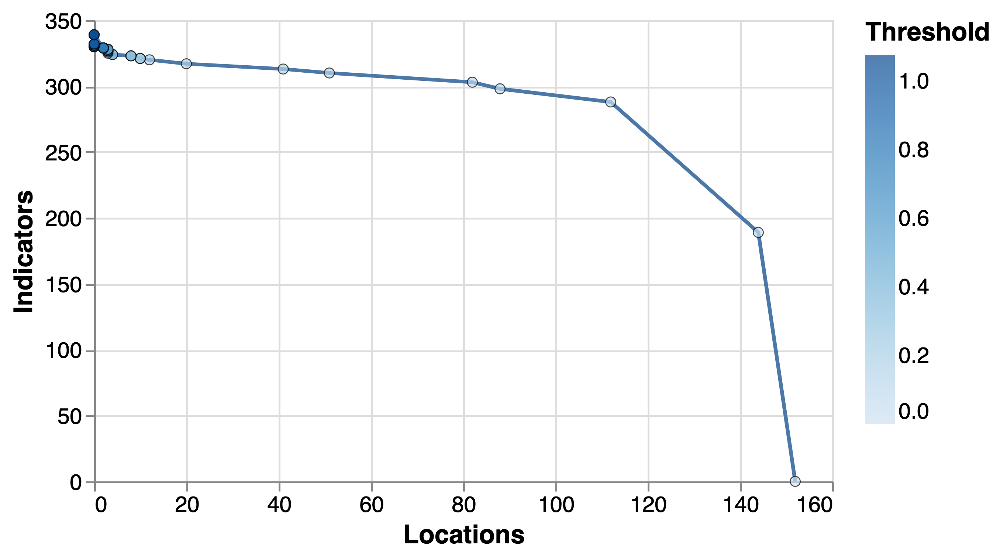

# Data and methodology

## Methodological narrative

Our goal in this project is to identify clusters of local authorities that are similar in a set of background conditions that are useful for explainin differences in their early year outcomes. In follow-up research we will sample these clusters in a survey aimed at understanding early years policies and practices that might explain differences in outcomes. In addition to this, we are interested in identifying _individual_ local authorities that under or over-perform their cluster's early year outcomes. They could be a useful setting for additional research aimed at explaining those differences.

In order to achieve our goals, we have implemented a "consequential clustering" pipeline where we use an array of indicators about local authorities from the Public Health Outcomes Framework (PHOF) to cluster them into groups. We tune the clustering algorithms with the goal of maximising differences in early year outcomes between clusters (that is the "consequential" outcome we are interested in). This requires a number of steps that we describe in detail in section @sec:method.

## Data sources {#sec:data}

### Early Year outcomes

TO BE ADDED

### Public Health Outcomes Framework

The main source of data we use for clustering is the [Public Health Outcomes Framework](https://fingertips.phe.org.uk/profile/public-health-outcomes-framework) (PHOF), a measurement framework maintained by the Office for Health Improvement and Disparities with the goal to "improve and protect the nation's health, and improve the health of the poorest fastest". The framework contains 180 indicators capturing a wide array of health outcomes, social determinants of health and background sociodemographic information.[^1]

[^1]: We have obtained it through the [Fingertips API](https://fingertips.phe.org.uk/api), which provides programmatic access to a wide range of public health indicators using the [`fingertips_py`](https://fingertips-py.readthedocs.io/en/latest/) Python package.

It is worth noting that we expect strong overlap / correlation between indicators in PHOF (for example, it includes mortality rates from a wide range of diseases) which we will address downstream using dimensionality reduction techniques. 

We also emphasise that we have focused our clustering on PHOF data for reasons of convenience. Our goal is not to cluster local authorities based on causal drivers of early year outcomes but to capture different types of local authority that display variation in those outcomes. Insofar the PHOF data indicators act as proxies for other relevant local conditions that are not included in the analysis (such as for example data about the industrial composition of a location, or about its detailed sociodemographic characteristics), it fulfils our purposes.[^3]

[^3]: Having said this, we would expect that incorporating other relevant dimensions of a local authority context in our analysis would improve the quality and usefulness of our clustering. This is an area for further work.

We process the data in the following ways: 

1. We remove indicators which are not available at the County / Unitary Authority (C/UA) level at which early year outcomes is released, and with which we want to merge our data.
2. Some of the indicators in PHFO are available by sex, age and other category types. We create a new indicator for each combinations of categories for which it is available (for example, the indicator "16-17 year olds not in education, employment or training (NEET) or whose activity is not known" is split into "16-17 year olds not in education, employment or training (NEET) or whose activity is not known: Female-16-17 yrs", "16-17 year olds not in education, employment or training (NEET) or whose activity is not known: Male-16-17 yrs" and "16-17 year olds not in education, employment or training (NEET) or whose activity is not known: Persons-16-17 yrs".
3. We focus on the latest period for which each indicator was collected.
4. We remove indicators where the percentage of C/UAs with missing data is below 2.5% and then remove a small number of C/UAs that still have missing data in at least one indicator. This includes Rutland, Isles of Scilly and Hammersmith and Fulham. We select this threshold with the goal of balancing indicator breadth versus good coverage of C/UAs. As @fig:complete shows, including indicators with poorer coverage reduces the number of C/UAs that we are able to cluster. The 2.5% of coverage threshold makes it possible for us to cluster most C/UAs using 189 indicators.[^4] 

{#fig:complete}

[^4]: An option to explore further would be to interpolate missing values in order to increase the number of indicators we are able to include for a given number of C/AUs.

### Other secondary data

TO BE ADDED

## Methods {#sec:method}

### Dimensionality reduction

### Robust clustering

### Consequential clustering evaluation